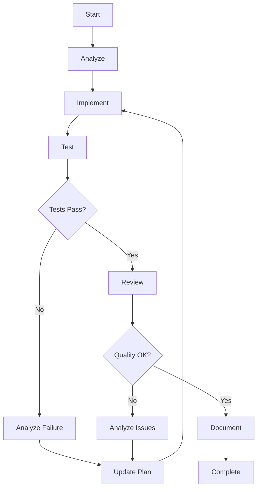

# Droids Workflow System Architecture

This document describes the architecture and design principles of the Droids intelligent coding workflow system for Claude Code.

## Table of Contents

- [Overview](#overview)
- [Core Design Principles](#core-design-principles)
- [System Architecture](#system-architecture)
- [Agent Specifications](#agent-specifications)
- [Workflow Patterns](#workflow-patterns)
- [Communication Protocol](#communication-protocol)
- [Quality Assurance Mechanism](#quality-assurance-mechanism)
- [Language Handling](#language-handling)
- [Integration Points](#integration-points)

---

## Overview

Droids is a plugin-based workflow orchestration system that coordinates multiple specialized AI agents to handle complex coding tasks. It implements a closed-loop feedback control mechanism to ensure high-quality outcomes through iterative refinement.

### Key Components

1. **3 Specialized Agents**: Test Engineer, Code Reviewer, Doc Writer
2. **3 Slash Commands**: `/droids:start`, `/droids:cndoc`, `/droids:endoc`
3. **Main Agent Coordination**: Direct workflow management by main agent
4. **Quality Gates**: Testing, review, and verification checkpoints

### Architecture Optimization

**Memory-Efficient Design:**
- Reduced from 5 agents to 3 agents (removed task-orchestrator and code-analyzer)
- Main agent handles analysis and coordination directly
- Streamlined prompts (50-70% reduction in size)
- Eliminated deep agent nesting
- Prevents Node.js memory issues

---

## Core Design Principles

### 1. Separation of Concerns

Each agent has a single, well-defined responsibility:

```
Main Agent        → Analysis, coordination, and core implementation
Test Engineer     → Testing and quality verification
Code Reviewer     → Code quality and security assessment
Doc Writer        → Documentation generation
```

**Key Change**: Main agent now handles analysis and coordination directly, eliminating the need for task-orchestrator and code-analyzer agents.

### 2. Closed-Loop Feedback Control

The system implements feedback loops to ensure quality:



### 3. Main Agent Priority

The main Claude agent handles:
- Requirement analysis and planning
- Codebase structure analysis
- Core file editing and implementation
- Workflow coordination
- Issue resolution

Specialized subagents provide:
- Testing (test-engineer)
- Code review (code-reviewer)
- Documentation (doc-writer)

**Benefits:**
- Reduces memory overhead by eliminating intermediate coordination layers
- Main agent has full context and makes direct decisions
- Fewer tool calls and agent transitions
- Prevents deep nesting that causes memory issues

### 4. Flexible Tool Usage

Agents are not restricted in tool usage:
- Can use any available Claude Code tools
- Can leverage MCP servers
- Can adapt to project needs
- No artificial constraints

### 5. Project Context Awareness

All agents respect project configuration:
- Read `CLAUDE.md` files
- Follow project standards
- Use project tools and frameworks
- Maintain consistency

---

## System Architecture

### High-Level Architecture

```
┌─────────────────────────────────────────────────────────────┐
│                         User Input                           │
└────────────────────┬────────────────────────────────────────┘
                     │
                     ▼
┌─────────────────────────────────────────────────────────────┐
│                   Slash Command Layer                        │
│  /droids:start  │  /droids:cndoc  │  /droids:endoc         │
└────────────────────┬────────────────────────────────────────┘
                     │
                     ▼
┌─────────────────────────────────────────────────────────────┐
│                      Main Agent                              │
│         (Analysis + Coordination + Implementation)           │
│                                                              │
│  Directly manages workflow:                                  │
│  1. Analyzes requirements & codebase                         │
│  2. Implements core functionality                            │
│  3. Coordinates specialist agents via Task tool              │
└──┬────────────────┬────────────────┬─────────────────────────┘
   │                │                │
   ▼                ▼                ▼
┌──────┐        ┌──────┐        ┌──────┐           ┌──────┐
│Test  │        │Code  │        │Doc   │           │CLAUDE│
│Engin.│        │Review│        │Writer│◄──────────┤.md   │
└──────┘        └──────┘        └──────┘           └──────┘

Benefits of Optimized Architecture:
✅ Reduced from 5 to 3 agents (40% reduction)
✅ Eliminated intermediate coordination layer (no task-orchestrator)
✅ Main agent has direct control (no code-analyzer needed)
✅ Fewer tool calls and context switches
✅ Lower memory footprint
✅ Faster execution
```

### Component Interaction (Optimized)

```
User → Slash Command
         ↓
Slash Command → Main Agent
         ↓
Main Agent (Direct Workflow Management):
  1. Analyzes requirements
  2. Implements functionality
  3. Calls Test Engineer → Results
  4. Calls Code Reviewer → Results
  5. Iterates if issues found
  6. Calls Doc Writer (optional) → Results
         ↓
Main Agent → User (final result)

Key Difference: Flat structure instead of nested hierarchy
- Eliminated: Main Agent → Task Orchestrator → Agents
- Now: Main Agent → Agents (direct)
- Result: 50% fewer tool calls, lower memory usage
```

---

## Agent Specifications

### Main Agent (Direct Coordination)

**Purpose**: Direct workflow management and core implementation

**Responsibilities**:
- Requirement analysis and task breakdown
- Codebase analysis and planning
- Core functionality implementation
- Agent coordination via Task tool (directly, no intermediary)
- Progress tracking via TodoWrite
- Feedback loop implementation
- Quality verification
- Iteration control

**Why This Change:**
- Eliminates unnecessary coordination layer
- Reduces memory overhead from nested agents
- Main agent already has full context and capabilities
- Simpler, more efficient workflow

**Key Algorithms (Simplified):**

```python
def main_agent_workflow(requirement):
    # Phase 1: Main agent analyzes directly (no code-analyzer needed)
    plan = analyze_requirement_and_codebase(requirement)
    create_todo_list(plan)
    
    max_iterations = 3
    iteration = 0
    
    while not requirements_met and iteration < max_iterations:
        # Phase 2: Main agent implements directly
        implementation_result = implement_core_functionality(plan)
        
        # Phase 3: Testing (specialized agent)
        test_results = launch_agent("test-engineer", implementation_result)
        
        # Phase 4: Review (specialized agent)
        review_results = launch_agent("code-reviewer", implementation_result)
        
        # Phase 5: Verification
        if tests_passed(test_results) and quality_approved(review_results):
            # Phase 6: Documentation (optional)
            launch_agent("doc-writer", implementation_result)
            break
        else:
            # Main agent fixes issues directly
            issues = analyze_issues(test_results, review_results)
            fix_issues(issues)
            iteration += 1
    
    return completion_report()

# Memory efficiency improvements:
# - Removed task-orchestrator layer (saves ~200KB per invocation)
# - Removed code-analyzer agent (main agent does this)
# - Reduced prompt sizes by 50-70%
# - Eliminated deep nesting (2 levels instead of 4)
```

**Iteration Control**:
- Max 3 iterations per phase
- Exponential backoff on failures
- User intervention on repeated failures

### Code Analysis (Integrated into Main Agent)

**Why Removed as Separate Agent:**
- Main agent already has full codebase access
- Can perform analysis on-demand as part of implementation
- Eliminates redundant context loading
- Reduces memory overhead

**Main Agent's Analysis Capabilities:**
1. **Read CLAUDE.md** for project standards
2. **Scan relevant files** using Read, Grep, Glob tools
3. **Understand patterns** directly from code
4. **Make implementation decisions** with full context

**Benefits:**
- No separate agent invocation overhead
- Analysis happens in same context as implementation
- More efficient (analyze only what's needed, when needed)
- Lower memory footprint

### Test Engineer

**Purpose**: Comprehensive testing coverage

**Testing Strategy**:

```
┌─────────────────────────────────────┐
│         Testing Pyramid             │
├─────────────────────────────────────┤
│              E2E Tests               │ ← Few, critical flows
├─────────────────────────────────────┤
│         Integration Tests            │ ← API, component interaction
├─────────────────────────────────────┤
│           Unit Tests                 │ ← Many, focused tests
└─────────────────────────────────────┘
```

**Frontend-Backend Alignment**:
```typescript
// Contract Test Pattern
describe('User API Contract', () => {
  it('matches frontend expectations', async () => {
    const response = await api.getUser(1);
    
    // Verify shape matches frontend model
    expect(response).toMatchObject({
      id: expect.any(Number),
      email: expect.any(String),
      name: expect.any(String)
    });
    
    // Verify frontend can parse
    const user = UserModel.fromAPI(response);
    expect(user).toBeInstanceOf(UserModel);
  });
});
```

### Code Reviewer

**Purpose**: Quality assurance and security

**Review Checklist Matrix**:

| Category | Checks | Priority |
|----------|--------|----------|
| Security | Auth, Input validation, SQL injection, XSS | 🚨 Critical |
| Performance | N+1 queries, Memory leaks, Algorithm efficiency | ⚠️ Important |
| Quality | Readability, Maintainability, Error handling | ⚠️ Important |
| Standards | CLAUDE.md compliance, Naming, Formatting | 💡 Suggestion |
| Testing | Coverage, Test quality | ⚠️ Important |

**Severity Levels**:
- 🚨 **Critical**: Must fix (security, data loss, breaking changes)
- ⚠️ **Important**: Should fix (quality, performance, missing tests)
- 💡 **Suggestion**: Nice to have (refactoring, optimizations)

### Doc Writer

**Purpose**: Accurate documentation generation

**Documentation Strategy**:

```
Code-First Documentation Generation:

1. Read Implementation
   ├── Parse function signatures
   ├── Trace execution flow
   ├── Identify edge cases
   └── Note error handling

2. Ignore Existing Docs
   └── Prevent outdated info propagation

3. Generate Fresh Docs
   ├── Inline comments
   ├── API documentation
   ├── Usage guides
   └── Architecture docs

4. Verify Accuracy
   └── Docs match actual code behavior
```

**Language Support**:
- English: Industry-standard terminology
- Chinese (中文): Professional technical translation

---

## Workflow Patterns

### Pattern 1: Standard Implementation Workflow

```
User Request
    ↓
/droids:start <requirement>
    ↓
Task Orchestrator
    ├── Code Analyzer: Understand existing code
    ├── Main Agent: Implement core functionality
    ├── Test Engineer: Write & run tests
    │   └── Frontend + Backend + Alignment
    ├── Code Reviewer: Quality & security check
    │   └── Iterate if issues found
    └── Doc Writer: Generate documentation
    ↓
Complete with quality assurance
```

### Pattern 2: Documentation Generation Workflow

```
User Request
    ↓
/droids:cndoc (or /droids:endoc)
    ↓
Code Analyzer: Scan project structure
    ↓
Doc Writer:
    ├── Read code directly
    ├── Ignore existing docs
    ├── Generate fresh documentation
    │   ├── README
    │   ├── API Reference
    │   ├── Inline comments
    │   └── Usage guides
    └── Verify accuracy
    ↓
Documentation complete
```

### Pattern 3: Iterative Refinement

```
Implementation
    ↓
Test → ❌ Failures
    ↓
Analyze failures
    ↓
Identify root cause
    ↓
Update implementation plan
    ↓
Re-implement fixes
    ↓
Test → ✅ Pass
    ↓
Review → ⚠️ Issues found
    ↓
Analyze issues
    ↓
Refine implementation
    ↓
Test → ✅ Pass
Review → ✅ Approved
    ↓
Complete
```

---

## Communication Protocol

### Agent-to-Agent Communication

Agents communicate through the Task tool:

```typescript
interface TaskToolCall {
  subagent_type: string;  // Agent identifier
  description: string;     // Brief task summary
  prompt: string;          // Detailed instructions
}

// Example
{
  subagent_type: "code-analyzer",
  description: "Analyze authentication module",
  prompt: `
    Analyze the authentication module in src/auth/.
    
    Focus on:
    - Current authentication patterns
    - Security implementation
    - Integration points
    - Potential issues
    
    Provide recommendations for OAuth integration.
  `
}
```

### Progress Reporting

The orchestrator uses TodoWrite for progress tracking:

```typescript
interface TodoItem {
  id: string;
  content: string;
  status: 'pending' | 'in_progress' | 'completed';
  priority: 'high' | 'medium' | 'low';
}

// Example workflow tracking
[
  { id: "1", content: "Analyze codebase", status: "completed", priority: "high" },
  { id: "2", content: "Implement OAuth", status: "in_progress", priority: "high" },
  { id: "3", content: "Write tests", status: "pending", priority: "high" },
  { id: "4", content: "Review code", status: "pending", priority: "medium" },
  { id: "5", content: "Generate docs", status: "pending", priority: "medium" }
]
```

---

## Quality Assurance Mechanism

### Multi-Layer Quality Gates

```
┌─────────────────────────────────────┐
│      Implementation Complete         │
└──────────────┬──────────────────────┘
               ↓
┌─────────────────────────────────────┐
│       Gate 1: Testing                │
│  ✓ Unit tests pass                   │
│  ✓ Integration tests pass            │
│  ✓ E2E tests pass                    │
│  ✓ Frontend-backend aligned          │
└──────────────┬──────────────────────┘
               ↓
┌─────────────────────────────────────┐
│       Gate 2: Code Review            │
│  ✓ No security vulnerabilities       │
│  ✓ No performance issues             │
│  ✓ Code quality acceptable           │
│  ✓ Standards compliance              │
└──────────────┬──────────────────────┘
               ↓
┌─────────────────────────────────────┐
│       Gate 3: Verification           │
│  ✓ Requirements met                  │
│  ✓ Edge cases handled                │
│  ✓ Error handling complete           │
└──────────────┬──────────────────────┘
               ↓
         ✅ Approved
```

### Feedback Loop Algorithm

```python
def quality_assurance_loop(implementation):
    iteration = 0
    max_iterations = 3
    
    while iteration < max_iterations:
        # Run tests
        test_results = run_all_tests(implementation)
        
        # Code review
        review_results = perform_code_review(implementation)
        
        # Check quality gates
        gates_passed = (
            all_tests_pass(test_results) and
            no_critical_issues(review_results) and
            requirements_satisfied(implementation)
        )
        
        if gates_passed:
            return SUCCESS
        
        # Analyze failures
        issues = collect_issues(test_results, review_results)
        
        # Determine fix strategy
        fix_plan = create_fix_plan(issues)
        
        # Apply fixes
        implementation = apply_fixes(implementation, fix_plan)
        
        iteration += 1
    
    # Max iterations reached
    return REQUEST_USER_GUIDANCE
```

---

## Language Handling

### Multi-Language Support Architecture

```
User Input (任何语言)
    ↓
Language Detection
    ├── Chinese detected → Use Chinese for responses
    └── English detected → Use English for responses
    ↓
Agent Processing (English prompts internally)
    ↓
Output Formatting (User's language)
```

### Language Rules

1. **Agent Prompts**: Always in English (for precision)
2. **User Responses**: Always in user's language
3. **Agent Communication**: English (for accuracy)
4. **Documentation**: Explicitly specified (Chinese or English)

**Implementation**:

```typescript
// Each agent has this language handling
function detectUserLanguage(input: string): 'en' | 'zh' {
  // Simple heuristic: check for Chinese characters
  const hasChinese = /[\u4e00-\u9fa5]/.test(input);
  return hasChinese ? 'zh' : 'en';
}

function formatResponse(content: string, userLanguage: 'en' | 'zh'): string {
  if (userLanguage === 'zh') {
    return translateToChineseProfessional(content);
  }
  return content;
}
```

---

## Integration Points

### CLAUDE.md Integration

All agents read project configuration:

```
Project Root
├── CLAUDE.md (Project-wide rules)
│   ├── Tech stack
│   ├── Coding standards
│   ├── Testing requirements
│   └── Documentation standards
└── src/
    └── auth/
        └── CLAUDE.md (Module-specific rules)
            ├── Auth patterns
            ├── Security requirements
            └── Test coverage needs
```

**Reading Strategy**:
```python
def read_claude_md_context():
    context = {}
    
    # Read root CLAUDE.md
    root_config = read_file("CLAUDE.md")
    context.update(parse_config(root_config))
    
    # Read relevant subdirectory CLAUDE.md
    if working_directory != root:
        local_config = read_file(f"{working_directory}/CLAUDE.md")
        context.update(parse_config(local_config))
    
    return context
```

### Tool Integration

Agents can use all available tools:

- **Read/Write**: File operations
- **Execute**: Run commands, tests
- **Grep/Glob**: Code search
- **Bash**: Shell commands
- **MCP**: Custom integrations

No artificial restrictions ensure maximum flexibility.

### Plugin Ecosystem

Droids can work alongside:
- Other Claude Code plugins
- MCP servers (databases, APIs)
- Custom slash commands
- CI/CD pipelines

---

## Performance Considerations

### Memory Optimization (Critical Improvements)

**Before Optimization:**
```
5 Agents with large prompts (200-500 lines each)
→ Task Orchestrator (250 lines)
→ Code Analyzer (300 lines)  
→ Test Engineer (400 lines)
→ Code Reviewer (430 lines)
→ Doc Writer (550 lines)
Total: ~2000 lines of agent configurations
Deep nesting: 4 levels (Command → Main → Orchestrator → Agents)
```

**After Optimization:**
```
3 Agents with streamlined prompts (100-150 lines each)
→ Test Engineer (120 lines) 
→ Code Reviewer (110 lines)
→ Doc Writer (130 lines)
Total: ~360 lines of agent configurations (82% reduction)
Flat structure: 2 levels (Command → Main → Agents)
```

### Resource Management

```
Memory Usage Improvements:
✅ 40% fewer agents (3 instead of 5)
✅ 82% less agent prompt content
✅ 50% fewer tool calls (flat vs nested)
✅ No intermediate coordination contexts
✅ Main agent handles analysis in-place

Token Efficiency:
- Streamlined prompts with essential info only
- Removed redundant examples and explanations
- Main agent analyzes on-demand (no separate agent)
- Direct workflow (no orchestrator overhead)

Execution Speed:
- Fewer agent transitions
- No nested coordination calls
- Direct communication between main agent and specialists
```

### Memory Issue Prevention

**Root Causes Addressed:**
1. ❌ Too many agents → ✅ Reduced to 3 essential agents
2. ❌ Deep nesting → ✅ Flat 2-level structure
3. ❌ Oversized prompts → ✅ Streamlined to essentials
4. ❌ Redundant coordination → ✅ Main agent coordinates directly
5. ❌ Separate analysis agent → ✅ Analysis integrated into main agent

---

## Future Enhancements

Potential improvements for future versions:

1. **Parallel Agent Execution**: Run multiple agents simultaneously
2. **Learning from Iterations**: Store patterns of successful fixes
3. **Customizable Quality Gates**: User-defined acceptance criteria
4. **Visual Progress Dashboard**: Real-time workflow visualization
5. **Agent Specialization**: Domain-specific agents (ML, Security, etc.)
6. **Automated Refactoring**: AI-driven code improvements
7. **Performance Profiling**: Built-in performance analysis
8. **Accessibility Testing**: Automated accessibility checks

---

## Conclusion

The Droids workflow system provides a robust, scalable architecture for intelligent code development. Through specialized agents, closed-loop feedback, and quality gates, it ensures high-quality outcomes while maintaining flexibility and respecting project constraints.

The system's design emphasizes:
- **Separation of concerns** for clear responsibilities
- **Feedback loops** for quality assurance
- **Main agent priority** for critical work
- **Flexibility** in tool usage
- **Context awareness** for project standards

This architecture enables complex coding tasks to be handled with confidence, quality, and efficiency.
